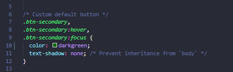
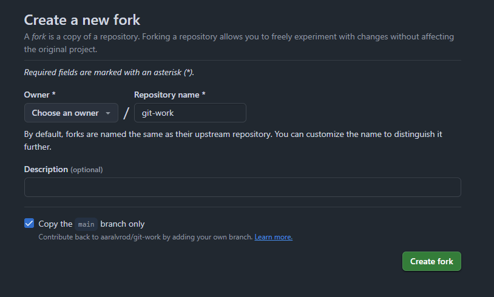

<center>

# UT1-A1 Documentación y sistema de control de versiones


</center>

***Nombre:*** Aarón Álvarez Ródriguez
***Curso:*** 2º de Ciclo Superior de Desarrollo de Aplicaciones Web.

### ÍNDICE

+ [Introducción](#id1)
+ [Objetivos](#id2)
+ [Material empleado](#id3)
+ [Desarrollo](#id4)
+ [Conclusiones](#id5)


#### ***Introducción***. <a name="id1"></a>

Aquí explicamos brevemente la parte teórica que tiene que ver con la práctica que se va a realizar


#### ***Objetivos***. <a name="id2"></a>

Aquí explicamos los objetivos que se pretenden alcanzar al realizar la práctica.

Practicar control de versiones

#### ***Material empleado***. <a name="id3"></a>

Enumeramos el material empleado tanto hardware como software y las configuraciones que hacemos (configuraciones de red por ejemplo) 

- PC
- Git
- Github
- VScode

#### ***Desarrollo***. <a name="id4"></a>

En esta parte explicamos detalladamente los pasos que seguimos para realizar la práctica incluyendo capturas de pantalla y explicando que vemos en ellas.

1. El alumnado trabajará por parejas: user1 y user2. Indicar quién es user1 y quién es user2.

user1: Aarón

user2: Eduardo

2. user1 creará un repositorio público llamado git-work en su cuenta de GitHub, añadiendo un README.md y una licencia MIT.



3. user1 clonará el repo y añadirá los ficheros: index.html, bootstrap.min.css y cover.css. Luego subirá los cambios al upstream.

``` git
git clone https://github.com/aaralvrod/git-work.git
```

``` bash
touch index.html bootstrap.min.css cover.css
```

``` git
git add .
git commit -m "Add init files"
git push 
```

4. user2 creará un fork de git-work desde su cuenta de GitHub.




5. user2 clonará su fork del repo.

``` git
git clone https://github.com/aaralvrod/git-work.git
```

6. user1 creará una issue con el título "Add custom text for startup contents".


7. user2 creará una nueva rama custom-text y modificará el fichero index.html personalizándolo para una supuesta startup.

``` git
git checkout -b custom-text
```
Modificar algo del index.html y subir foto

``` git
git add index.html
git commit -m "Add custom startup text to index.html"
git push origin custom-text
```

8. user2 enviará un PR a user1.


9. user1 probará el PR de user2 en su máquina (copia local) creando previamente un remoto denominado upstream, y realizará ciertos cambios en su copia local que luego deberá subir al propio PR.

``` git
git remote add upstream https://github.com/aaralvrod/git-work.git
git fetch upstream
git checkout -b
```
modificar index.html

``` git
git add index.html
git commit -m "Adjust startup text formatting"
git push upstream custom-text
```


10. user1 y user2 tendrán una pequeña conversación en la página del PR, donde cada usuario incluirá, al menos, un cambio más.
11. user1 finalmente aprobará el PR, cerrará la issue creada (usando una referencia a la misma) y actualizará la rama principal en su copia local.
12. user2 deberá incorporar los cambios de la rama principal de upstream en su propia rama principal.
13. user1 creará una issue con el título "Improve UX with cool colors".
14. user1 cambiará la línea 10 de cover.css a: color: purple;
15. user1 hará simplemente un commit local en main → NO HACER git push.
16. user2 creará una nueva rama cool-colors y cambiará la línea 10 de cover.css a: color: darkgreen;
17. user2 enviará un PR a user1.
18. user1 probará el PR de user2 (en su copia local). A continuación tratará de mergear el contenido de la rama cool-colors en su rama principal y tendrá que gestionar el conflicto: Dejar el contenido que viene de user2.
19. Después del commit para arreglar el conflicto, user1 modificará la línea 11 de cover.css a: text-shadow: 2px 2px 8px lightgreen;
20. user1 hará un commit especificando en el mensaje de commit el cambio hecho (sombra) y que se cierra la issue creada (usar referencia a la issue). A continuación subirá los cambios a origin/main.
21. user1 etiquetará esta versión (en su copia local) como 0.1.0 y después de subir los cambios creará una "release" en GitHub apuntando a esta etiqueta.


> ***IMPORTANTE:*** si estamos capturando una terminal no hace falta capturar todo el escritorio y es importante que se vea el nombre de usuario.

Si encontramos dificultades a la hora de realizar algún paso debemos explicar esas dificultades, que pasos hemos seguido para resolverla y los resultados obtenidos.

#### ***Conclusiones***. <a name="id5"></a>

En esta parte debemos exponer las conclusiones que sacamos del desarrollo de la prácica.