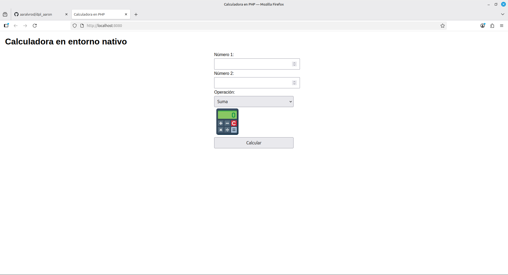
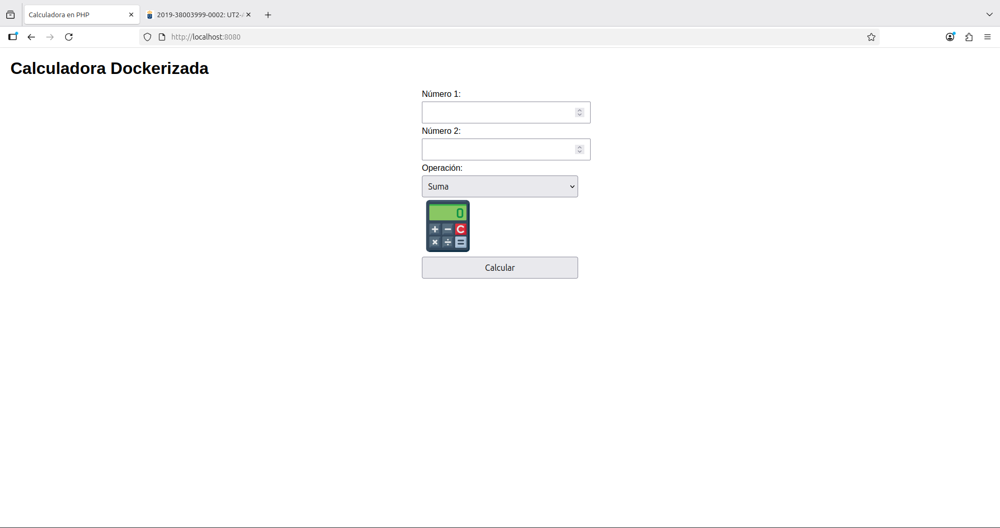

<center>

UT2-A1: Implantación de arquitecturas web

</center>

***Nombre:*** Aarón Álvarez Rodríguez

***Curso:*** 2º de Ciclo Superior de Desarrollo de Aplicaciones Web.

### ÍNDICE

+ [Introducción](#id1)
+ [Objetivos](#id2)
+ [Material empleado](#id3)
+ [Desarrollo](#id4)
+ [Conclusiones](#id5)


#### ***Introducción***. <a name="id1"></a>

Implementar una aplicación PHP que funcione como calculadora usando nginx + PHP-FPM

#### ***Objetivos***. <a name="id2"></a>

Practicar con Docker y Nginx

#### ***Material empleado***. <a name="id3"></a>

Enumeramos el material empleado tanto hardware como software y las conficuraciones que hacemos (configuraciones de red por ejemplo) 

- PC
- VirtualBox
- VScode
- Docker


#### ***Desarrollo***. <a name="id4"></a>

## Entorno nativo

1. **Clonar repositorio en el home**

``` git
git clone https://github.com/aaralvrod/dpl_aaron.git
```

2. **Instalar nginx y php-fpm**

```bash
sudo apt update
sudo apt install -y nginx php-fpm
```

3. **Comprobar que esten activos**

``` bash
sudo systemctl status nginx
sudo systemctl status php8.3-fpm
```


4. **Configuramos nginx, para ello hacemos `sudo nano /etc/nginx/sites-available/calculadora`**

``` nginx
server {
    listen 8023;
    server_name localhost;

    root /home/aaralvrod/dpl_aaron/ut2/a1;
    index index.php;

    location / {
        try_files $uri $uri/ /index.php?$query_string;
    }

    location ~ \.php$ {
        include snippets/fastcgi-php.conf;
        fastcgi_pass unix:/run/php/php8.3-fpm.sock;
    }

    location ~* \.(css|png|jpg|jpeg|gif|svg)$ {
        try_files $uri =404;
        expires 7d;
    }
}
```

5. **Creamos un enlace simbolico**

``` bash
sudo ln -s /etc/nginx/sites-available/calculadora /etc/nginx/sites-enabled/
```

6. **Comprobamos que la sintaxtis del archivo de configuracion de nginx sea correcta**

``` bash
sudo nginx -t
```

7. **Recargamos nginx**

``` bash
sudo systemctl reload nginx
```

8. **Abrimos en el navegador -> `http://localhost:8023`**

**Resultado**



## Entorno Dockerizado

1. **Instalar Docker**

``` bash
sudo curl -fsSL https://get.docker.com/ -o get-docker.sh
sudo sh get-docker.sh
sudo usermod -aG docker aaralvrod
```

2. **Creamos el Dockerfile**

``` docker
FROM php:8.3-fpm

RUN apt-get update && apt-get install -y nginx && rm -rf /var/lib/apt/lists/*

COPY . /var/www/html

RUN echo 'server { \
    listen 8023; \
    server_name localhost; \
    root /var/www/html; \
    index index.php index.html; \
    location / { try_files $uri $uri/ /index.php?$query_string; } \
    location ~ \.php$ { \
        include fastcgi_params; \
        fastcgi_pass 127.0.0.1:9000; \
        fastcgi_param SCRIPT_FILENAME $document_root$fastcgi_script_name; \
    } \
}' > /etc/nginx/sites-available/default

RUN chmod -R www-data:www-data /var/www/html

EXPOSE 8023

CMD ["sh", "-c", "php-fpm -F & nginx -g 'daemon off;'"]
```

3. **Creamos el contenedor**

``` bash
sudo docker build -t calculadora_dockerizada .
```

4. **Corremos el contenedor**

``` bash
sudo docker run -d -p 8023:8023 calculadora_dockerizada
```

**Resultado**



> ***IMPORTANTE:*** si estamos capturando una terminal no hace falta capturar todo el escritorio y es importante que se vea el nombre de usuario.

#### ***Conclusiones***. <a name="id5"></a>

Una practica un poco complicada para gente que no ha visto nada de docker, nginx ni php-fpm en su vida como puede ser mi caso pero gracias a la documentacion del campus y compañeros se pudo completar. 