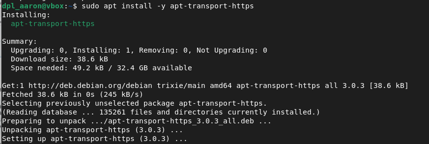
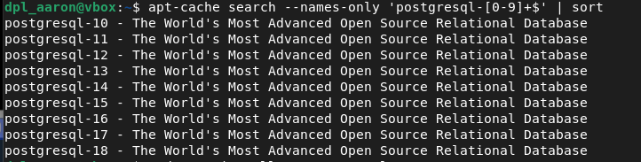
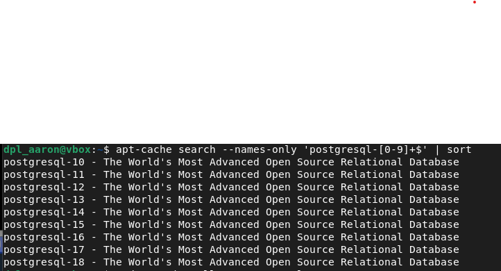
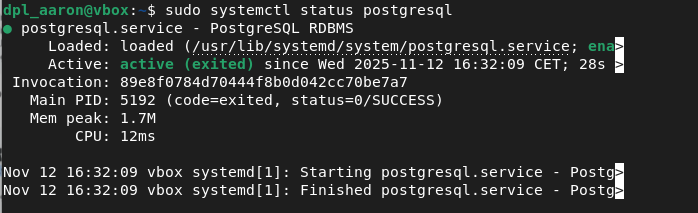
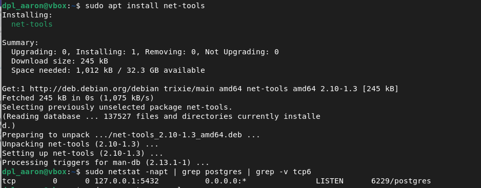
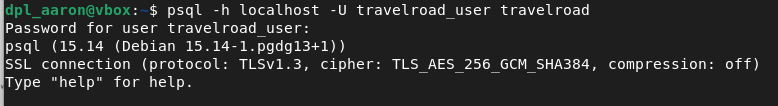
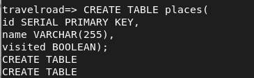
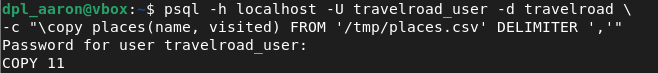
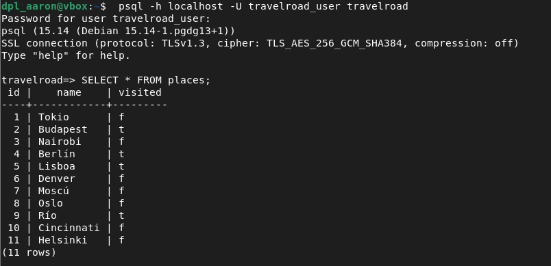

<center>

# INSTALACIÓN Y CONFIGURACIÓN DE PostgreSQL Y pgAdmin (ACTIVIDAD PARA ESCENARIO TELEMÁTICO)


</center>

***Nombre:*** Aaron Alvarez Rodriguez
***Curso:*** 2º de Ciclo Superior de Desarrollo de Aplicaciones Web.

### ÍNDICE

+ [Objetivos](#id2)
+ [Material empleado](#id3)
+ [Desarrollo](#id4)


#### ***Objetivos***. <a name="id2"></a>

El objetivo de esta tarea es la instalación y configuración  de forma guiada de **PostgreSQL** y **pgAdmin** en la máquina de desarrollo.  Se trata de una actividad diseñada para el escenario telemático.

#### ***Material empleado***. <a name="id3"></a>

Máquina virtual con el sistema operativo **Debian 12 server** 

#### ***Desarrollo***. <a name="id4"></a>


1. Actualizamos los paquetes

``` bash
sudo apt update
```

2. Instalamos paquetes de soporte

```bash
sudo apt install -y apt-transport-https
```

**Imagen**



3. Descargamos la clave de firma de PostgreSQL

``` bash
 curl -fsSL https://www.postgresql.org/media/keys/ACCC4CF8.asc \
| sudo gpg --dearmor -o /etc/apt/trusted.gpg.d/postgresql.gpg
```

4. Añadimos el repositorio oficial de PostgreSQL

``` bash
 echo "deb http://apt.postgresql.org/pub/repos/apt/ $(lsb_release -cs)-pgdg main" \
| sudo tee /etc/apt/sources.list.d/postgresql.list > /dev/null
```

5. Actualizamos los paquetes nuevamente

``` bash
sudo apt update
```

6. Mostramos las versiones disponibles para instalar

``` bash
apt-cache search --names-only 'postgresql-[0-9]+$' | sort
```

**Imagen**



7. Instalamos la version 15

``` bash
sudo apt install -y postgresql-15
```

8. Revisamos la version instalada

``` bash
 psql --version
```
**Imagen**


9. Comprobamos el estado

``` bash
sudo systemctl status postgresql
```
**Imagen**



10. Comprobamos el puerto de en el que trabaja postgre

``` bash
sudo apt install net-tools
sudo netstat -napt | grep postgres | grep -v tcp6
```
**Imagen**



11. Iniciamos sesion en el gestor de base de datos

``` bash
sudo -u postgres psql
```

12. Creamos un rol de accesoa la base de datos

``` bash
sudo -u postgres psql
```

13. Creamos usuario 

``` SQL
CREATE USER travelroad_user WITH PASSWORD 'dpl0000';
CREATE ROLE
```

14. Creamos la base de datos

``` SQL
CREATE DATABASE travelroad WITH OWNER travelroad_user;
CREATE DATABASE
```

15. Entramos a la base de datos con el nuevo usuario

``` bash
psql -h localhost -U travelroad_user travelroad
```
**Imagen**



16. Creamos tabla de lugares

``` SQL
CREATE TABLE places(
id SERIAL PRIMARY KEY,
name VARCHAR(255),
visited BOOLEAN);
CREATE TABLE
```
**Imagen**



17. Cargamos datos del fichero places.csv

``` bash
curl -o /tmp/places.csv https://raw.githubusercontent.com/sdelquin/dpl/main/ut4/files/places.csv
```

18. Insertamos los datos en Postgre

``` SQL
 psql -h localhost -U travelroad_user -d travelroad \
-c "\copy places(name, visited) FROM '/tmp/places.csv' DELIMITER ','"
```
**Imagen**



19. Comprobamos que los datos se hayan insertado de manera correcta

``` bash
psql -h localhost -U travelroad_user travelroad
```
**Imagen**



