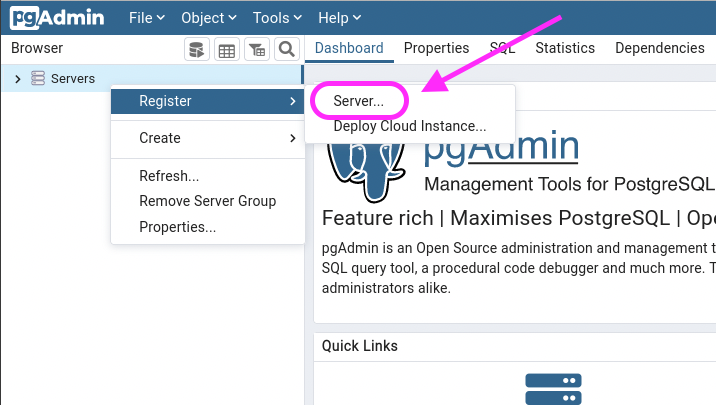
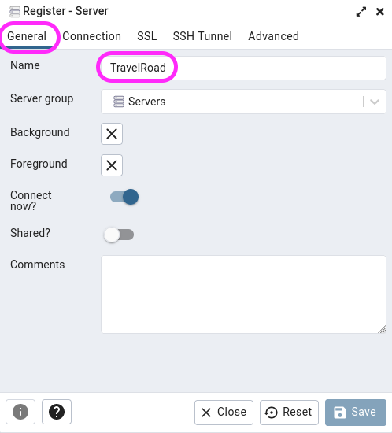
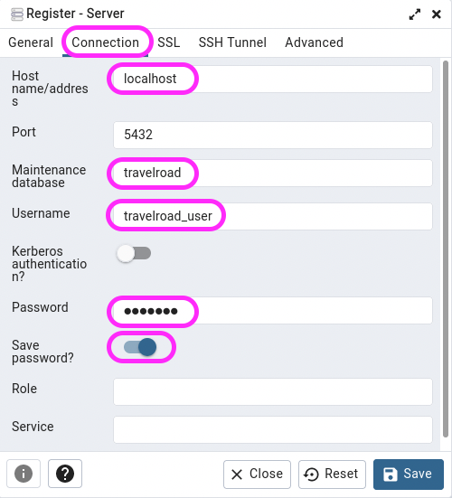

# INSTALACIÓN Y CONFIGURACIÓN DE PostgreSQL, pgAdmin Y APLICACIÓN PHP TRAVELROAD

**Nombre:** Aaron
**Curso:** 2° de Ciclo Superior de Desarrollo de Aplicaciones Web

## ÍNDICE
1.  Objetivos
2.  Material empleado
3.  Desarrollo
    1.  Instalación y configuración de PostgreSQL
    2.  Carga de datos de prueba
    3.  Instalación y configuración de pgAdmin
    4.  Desarrollo de aplicación PHP TravelRoad
    5.  Despliegue en producción
    6.  Script de despliegue automático
4.  URLs de acceso
5.  Repositorio de código
6.  Problemas encontrados y soluciones

## 1. Objetivos
Desplegar una aplicación web PHP (TravelRoad) con base de datos PostgreSQL, gestionada mediante pgAdmin, en entornos de desarrollo y producción con dominios específicos.

## 2. Material empleado
*   **Máquina de desarrollo:** Debian 12 (sin entorno gráfico)
*   **Máquina de producción:** Debian 12 en Arkánia (sin entorno gráfico)
*   **Máquina cliente:** Con entorno gráfico para pruebas

## 3. Desarrollo

### 3.1. Instalación y configuración de PostgreSQL


```bash
sudo apt update
sudo apt install -y postgresql-15 postgresql-contrib
```

Configuración de credenciales

``` sql
CREATE USER travelroad_user WITH PASSWORD 'password_desarrollo';
CREATE DATABASE travelroad OWNER travelroad_user;
```

### 3.2 Carga de datos de prueba

Carga de datos de prueba

``` bash
curl -o /tmp/places.csv https://raw.githubusercontent.com/sdelquin/dpl/main/ut4/files/places.csv
```

### 3.3 Instalación y configuración de pgAdmin


Aseguramos la ruta de los binarios de python

``` bash
echo 'export PATH=~/.local/bin:$PATH' >> .bashrc && source .bashrc
```

Instalación

``` bash
sudo mkdir /var/lib/pgadmin
sudo mkdir /var/log/pgadmin
sudo chown $USER /var/lib/pgadmin
sudo chown $USER /var/log/pgadmin

cd $HOME

python -m venv pgadmin4

source pgadmin4/bin/activate

pip install pgadmin4

pgadmin4
```

Rellenamos la configuración

``` bash
(pgadmin4) xxxxxx:~$ pgadmin4
NOTE: Configuring authentication for SERVER mode.

Enter the email address and password to use for the initial pgAdmin user account:

Email address: xxxxxxx@xxxx.com
Password:
Retype password:
pgAdmin 4 - Application Initialisation
======================================

Starting pgAdmin 4. Please navigate to http://127.0.0.1:5050 in your browser.
2022-12-01 13:37:45,485: WARNING	werkzeug:	WebSocket transport not available. Install simple-websocket for improved performance.
 * Serving Flask app 'pgadmin' (lazy loading)
 * Environment: production
   WARNING: This is a development server. Do not use it in a production deployment.
   Use a production WSGI server instead.
 * Debug mode: off
```

Instalamos gunicorn

``` bash
pip install gunicorn
```

Levantamos el servidor

``` bash
gunicorn \
--chdir pgadmin4/lib/python3.11/site-packages/pgadmin4 \
--bind unix:/tmp/pgadmin4.sock pgAdmin4:app
```

Creamos el virtual host

``` bash
sudo vi /etc/nginx/conf.d/pgadmin.conf
```

``` conf
server {
    server_name pgadmin.arkania.es;

    location / {
        proxy_pass http://unix:/tmp/pgadmin4.sock;  # socket UNIX
    }
}
```

Demonizamos el servicio

```bash
sudo vi /etc/systemd/system/pgadmin.service
```

```
[Unit]
Description=pgAdmin

[Service]
User=sdelquin
ExecStart=/bin/bash -c '\
source /home/xxxxxx/pgadmin4/bin/activate && \
gunicorn --chdir /home/xxxxxx/pgadmin4/lib/python3.11/site-packages/pgadmin4 \
--bind unix:/tmp/pgadmin4.sock \
pgAdmin4:app'
Restart=always

[Install]
WantedBy=multi-user.target 
```

Recargamos los servicios

``` bash
sudo systemctl daemon-reload
sudo systemctl start pgadmin
sudo systemctl enable pgadmin
```

Comprobamos que el servicio funciona correctamente

``` bash
sudo systemctl is-active pgadmin
active
```

Registramos el servidor





Para acceder externamente hacemos lo siguiente

```bash
sudo vi /etc/postgresql/15/main/postgresql.conf
```

Y añadimos la siguiente linea

```
listen_addresses = '*'
```

Otorgamos permisos al usuario travelroad_user a la base de datos travelroad

``` bash
sudo vi /etc/postgresql/15/main/pg_hba.conf
```
Y añadimos al final del fichero lo siguinte

```
host travelroad travelroad_user 0.0.0.0/0 md5
``` 

Recargamos

```
sudo systemctl restart postgresql
```

Comprobamo que el servicio PostgreSQL ya está escuchando en todas las IPs:

``` bash
sudo netstat -napt | grep postgres | grep -v tcp6

tcp        0      0 0.0.0.0:5432            0.0.0.0:*               LISTEN      23700/postgres
```

# Entorno de desarrollo

1. Instalamos lo siguiente `sudo apt install -y php8.2-pgsql` para tener disponible la función pg_connect.

2. Desarrollamos la aplicacion php

``` php
<?php
include 'config.php';

$conn = pg_connect("host=$host dbname=$dbname user=$user password=$password");

if (!$conn) {
    die("Error de conexión");
}

$sql = "SELECT name, visited FROM places ORDER BY visited, name";
$result = pg_query($conn, $sql);
?>

<!DOCTYPE html>
<html>
<head>
    <title>TravelRoad</title>
</head>
<body>
    <h1>My Travel Bucket List</h1>
    
    <h2>Places I'd Like to Visit</h2>
    <ul>
    <?php while ($row = pg_fetch_assoc($result)): ?>
        <?php if (!$row['visited']): ?>
            <li><?= htmlspecialchars($row['name']) ?></li>
        <?php endif; ?>
    <?php endwhile; ?>
    </ul>
    
    <h2>Places I've Already Been To</h2>
    <ul>
    <?php pg_result_seek($result, 0); ?>
    <?php while ($row = pg_fetch_assoc($result)): ?>
        <?php if ($row['visited']): ?>
            <li><?= htmlspecialchars($row['name']) ?></li>
        <?php endif; ?>
    <?php endwhile; ?>
    
    <?php pg_close($conn); ?>
    </ul>
</body>
</html>
```

Configuramos el servidor de nginx

```
server {
    server_name php.travelroad.local;
    root /home/dpl_alumno/xxxxxx/ut4/a2/travelroad;
    
    index index.php index.html;
    
    location / {
        try_files $uri $uri/ =404;
    }
    
    location ~ \.php$ {
        include fastcgi_params;
        fastcgi_pass unix:/var/run/php/php8.4-fpm.sock;
        fastcgi_param SCRIPT_FILENAME $document_root$fastcgi_script_name;
    }
}
```

Creamos un config.php que se utiliza en el index.php

```
<?php
$host = "localhost";
$dbname = "travelroad";
$user = "travelroad_user";
$password = "dpl0000";
?>
```

Comprobamos que la sintaxis este correcta y restarteamos nginx

``` bash
sudo nginx -t
sudo systemctl restart nginx
```

Creamos el deploy.sh

```
#!/bin/bash
ssh nombremaquina@ipmaquina "cd repositorio && git pull"
```

# Entorno de producción

Clonamos el repositorio

Configuramos el virtual host de producción

```
server {
    server_name php.travelroad.xxxxxx.arkania.es;
    root /home/dpl_alumno/xxxxxx/ut4/a2/travelroad;
    
    index index.php index.html;
    
    location / {
        try_files $uri $uri/ =404;
    }
    
    location ~ \.php$ {
        include fastcgi_params;
        fastcgi_pass unix:/var/run/php/php8.4-fpm.sock;
        fastcgi_param SCRIPT_FILENAME $document_root$fastcgi_script_name;
    }
}
```

Comprobamos que la sintaxis este correcta y restarteamos nginx

``` bash
sudo nginx -t
sudo systemctl restart nginx
```

